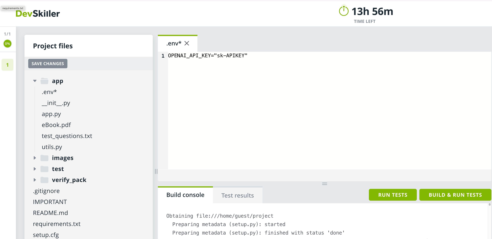

# Retrieval Augmented Generation

## Task Overview

Your task is to develop a Python-based solution for a Retrieval-Augmented Generation (RAG) system. This solution should handle natural language queries and provide a pertinent response to the question based on the input PDF document. 

Your solution must utilize a vector database (of your choice) for extracting contextual insights from the provided PDF document, which will subsequently guide the answer formulation process.

You can utilize frameworks such as LangChain or LlamaIndex for this task (but you are not limited to these frameworks). 

Note: Please do *NOT* modify any of the tests in the test folder.

## Prerequisites

Completion of this task requires the use of `Python 3.11`.


## Resources Provided

- Data Source: A textual document, `app/eBook.pdf`, will serve as your primary knowledge repository.

- Test Questions: A trio of questions stored in `app/test_questions.txt` will be used to assess the efficacy of your solution.

- API Key Requirement: Ensure that the OpenAI API key that was sent to you is added to `app/.env` with `OPENAI_API_KEY`. You can add this locally or directly on the DevSkiller IDE.
- If you are using DevSkiller's IDE:


<p align="center">Add `.env` in the app folder</p>

- If you are developing locally:
You should commit the `.env` file to your repository. 


## Expected Deliverables

Your submission package should encompass:

- RAG Pipeline Scripts: One or more Python scripts embodying the RAG pipeline's logic and functionality.

- Documented Code: Thoroughly commented scripts describing your approach.

- Execution Protocol: The `main` method within the `RAG` class of `app/app.py` must trigger the comprehensive pipeline, yielding a structured output as specified.

## Keep in mind

* You should not modify the unit tests.

* It would be faster to develop your solution locally and then push it to DevSkiller with:

- `git add .`
- `git commit -m "Solution"`
- `git push origin master` 

* To execute the unit tests, use:

```sh
pip install -r requirements.txt && python3 setup.py pytest
```

* DevSkiller will run for automatic build and testing with:

```sh
pip install . && python3 setup.py pytest
```

Make sure to add any additional dependencies to `setup.py`, and change the Python libraries versions as needed. Make sure to upload to DevSkiller early on if you are developing locally to see possible issues with the platform early.